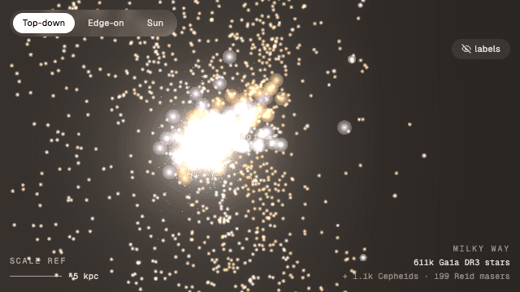

# Milky Way

Interactive WebGL visualization of the Milky Way: ~250 k real Gaia DR3
stars rendered as colored billboards on top of a procedural artist's-
impression backdrop (four-arm logarithmic spiral, warm galactic core,
dust lanes, bloom post-FX).



## What's on screen

| Layer | What | How |
|---|---|---|
| 1. Galactic core | Bright warm bulge + Sgr A\* marker | Gaussian fireball shader on a small disc |
| 2. Spiral disc | Logarithmic 4-arm spiral with dust-lane fbm noise, slow rotation | Large flat shader plane |
| 3. Real star field | ~250 k brightest Gaia DR3 stars with real BP-RP colors and G-mag-scaled brightness | GPU `Points` with custom vert + frag |
| 4. Bloom | Soft glow on the brightest cores | `@react-three/postprocessing` |
| 5. Named labels | 20 famous bright stars (Sirius, Vega, Betelgeuse, …) | `drei/Html` overlays |

## Interaction

- **Mouse drag / scroll / right-drag** → orbit / zoom / pan
- **Top-down ⇄ Edge-on ⇄ Sun** pill (top-left) tweens the camera over
  1.5 s with a smootherstep ease
- **Rotation** pill (top-right) plays / pauses the spiral animation
- **Labels** pill toggles the famous-star overlays

## Running

```bash
npm install
npm run dev
# open http://localhost:3000 (or PORT=3020 npm run dev to match the demo URL)
```

## Project layout

```
app/                          Next.js App Router root
components/
  Galaxy.tsx                  Composition: Canvas + scene + HUD + time loop
  StarField.tsx               GPU Points with binary star data
  SpiralDisc.tsx              Procedural spiral-arm backdrop mesh
  GalacticCore.tsx            Bulge + Sgr A* marker
  NamedStars.tsx              drei <Html> labels for famous stars
  CameraController.tsx        OrbitControls + preset fly-in tween
  hud/
    ViewToggle.tsx            Top-down / Edge-on / Sun pill
    PlayToggle.tsx            Rotation play / pause
    LabelsToggle.tsx          Named-label show / hide
    ScaleBar.tsx              Bottom-left ~5 kpc reference legend
    InfoChip.tsx              Bottom-right star count + project tag
lib/
  galacticCoords.ts           Equatorial -> galactocentric kpc transform
  starUtils.ts                BP-RP -> T_eff -> RGB color helpers
  namedStars.ts               Hand-picked iconic stars (SIMBAD/Hipparcos)
shaders/
  stars.vert.ts               Per-star size from G-mag + perspective
  stars.frag.ts               Soft glow + halo + tiny white spike
  spiral.vert.ts              Pass-through for the disc planes
  spiral.frag.ts              Logarithmic spiral + dust-lane fbm
  core.frag.ts                Two-component gaussian bulge glow
public/milkyway/
  stars.bin                   250k packed Float32Array records (LFS)
  manifest.json               Star count + bounds + record format
  demo.gif                    README hero (~2.3 MB)
scripts/
  fetch-gaia.py               ADQL TAP query against ESA's Gaia archive
  stars-to-binary.py          CSV -> Float32Array packing
  capture-gif.mjs             Records demo.gif via playwright + ffmpeg
```

## Data

`public/milkyway/stars.bin` is a packed Float32Array (32 bytes per
record: `x y z bp_rp g_mag r g b`) of the **brightest 250 k Gaia DR3
sources** with positive parallax and valid BP-RP color. Coordinates
are galactocentric kpc using the GRAVITY Coll. 2019 Sun position
(R = 8.122 kpc, z = 0.0208 kpc). Star colors are baked from the
piecewise Mamajek BP-RP → T_eff anchors and the Tanner Helland
blackbody RGB approximation, so the renderer doesn't have to redo
those at vertex shading time.

To regenerate (takes ~2 min):

```bash
python3 scripts/fetch-gaia.py --out /tmp/gaia.csv --limit 250000
python3 scripts/stars-to-binary.py --in /tmp/gaia.csv --out public/milkyway
```

To regenerate `demo.gif` (requires `ffmpeg` and the dev server running
on :3020):

```bash
node scripts/capture-gif.mjs --duration 9 --fps 10 --out public/milkyway/demo.gif
```

**Data source:** ESA / Gaia DR3 (`gaiadr3.gaia_source`), licensed CC-BY-SA.
Please cite the [Gaia mission](https://www.cosmos.esa.int/web/gaia/dr3)
if you reuse the bundled binary.

## Why a hybrid render

Gaia's "brightest 250 k" cut is heavily biased toward the solar
neighborhood — apparent brightness drops with the square of distance,
so most of the visible sample sits within ~kpc of the Sun. As a
result the real-data layer alone looks like a dense local star cluster
rather than "the Milky Way".

The procedural layer (spiral arms + warm bulge + dust lanes) supplies
the rest of the galactic structure that no apparent-magnitude-limited
catalog can. Combined, you get:

- the local star field at its true colors and 3D positions, plus
- the broader galactic shape with all its iconic structural cues.

## Performance

- 250 k `Points` with a single draw call and a custom soft-glow shader
- Additive blending sums overlapping halos without alpha sorting cost
- Bloom is a single mipmap-blur pass at a high luminance threshold so
  only the brightest cores actually trigger it
- Sprite size is conservative (0.8..4.5 base, perspective-clamped to
  0.8..3× distance scale) so the local pile-up doesn't oversaturate
- Rotation lives on a shared `timeRef` updated by a rAF loop;
  per-frame consumers read it via `useFrame` so the React tree
  doesn't reconcile on every animation tick

## License

MIT for the code in this repo. The bundled Gaia DR3 star binary
under `public/milkyway/` is a derivative of ESA's CC-BY-SA dataset —
see the Data section above for citation.
